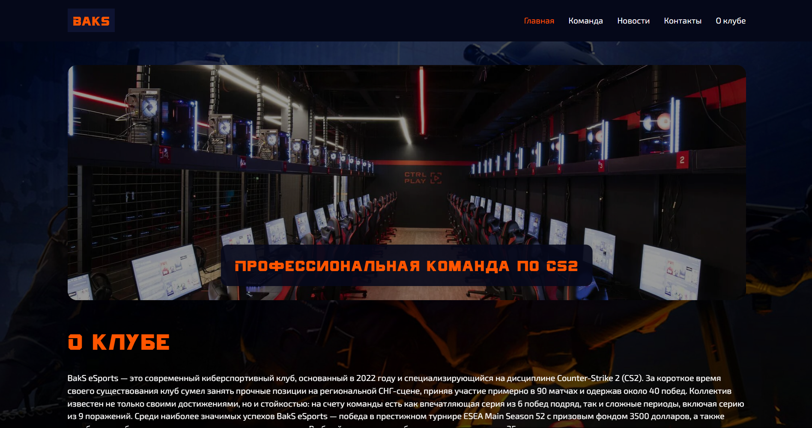
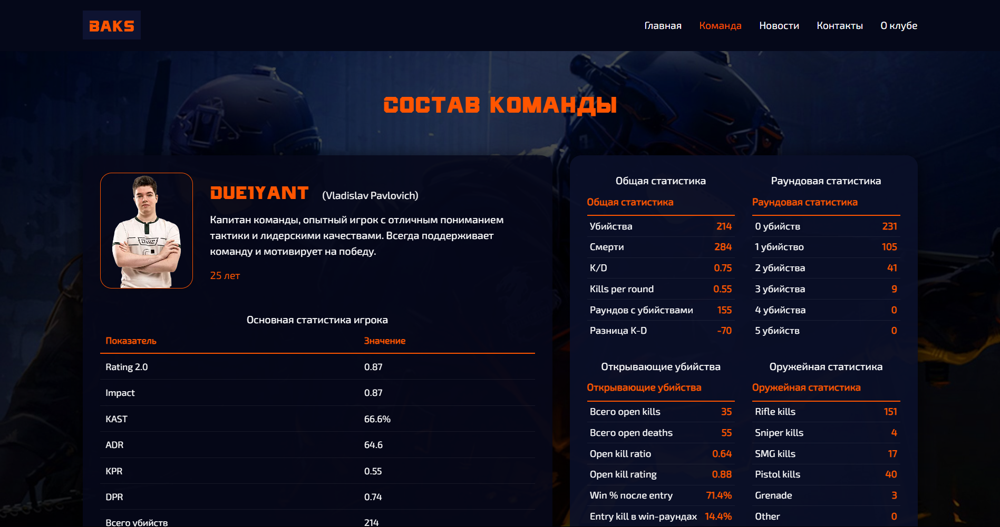
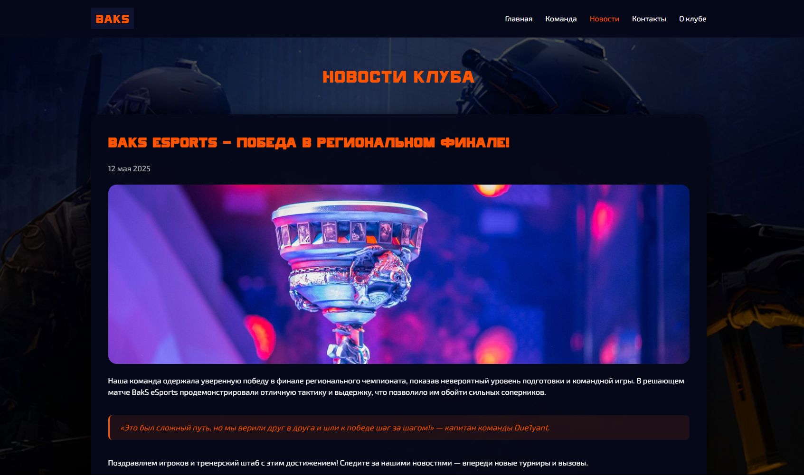
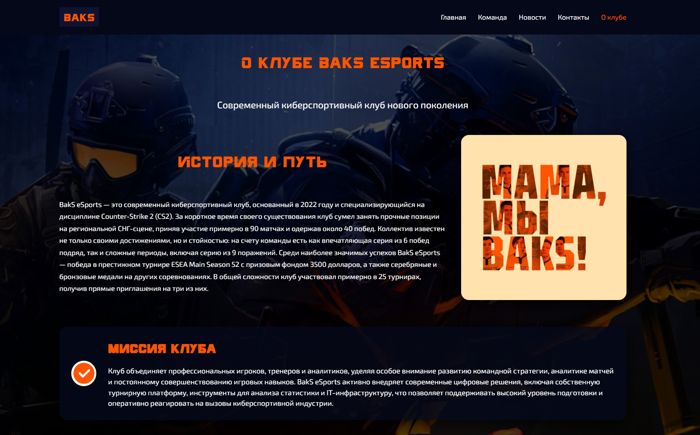
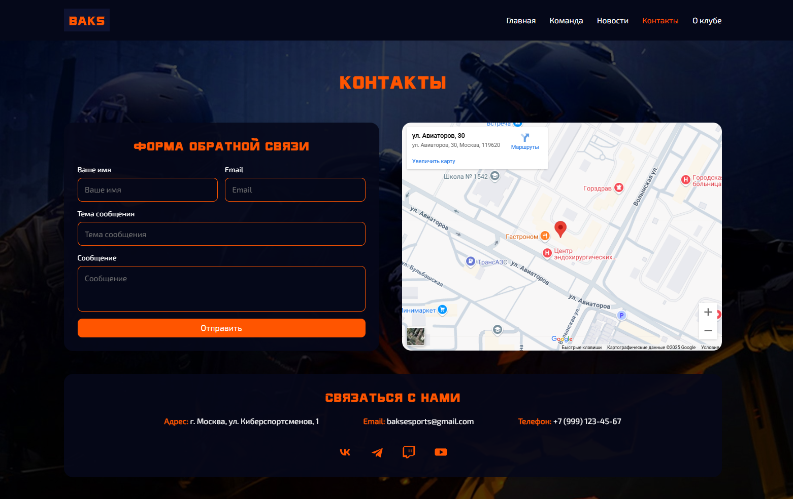
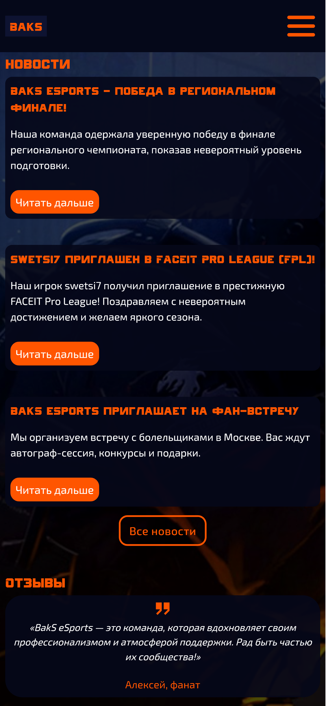

# 🎮 BakS eSports — Официальный сайт киберспортивного клуба

[](https://markup-dev.github.io/markup-dev.gitgub.io/)
[](https://developer.mozilla.org/en-US/docs/Web/HTML)
[](https://developer.mozilla.org/en-US/docs/Web/CSS)
[](https://developer.mozilla.org/en-US/docs/Web/JavaScript)

## 📋 Описание проекта

Официальный сайт киберспортивного клуба **BakS eSports** — современный веб-ресурс, представляющий команду по Counter-Strike 2. Сайт создан с использованием чистого HTML, CSS и JavaScript, обеспечивая быструю загрузку и отличную производительность.

### 🏆 О клубе
- **Основан:** 2022 год
- **Дисциплина:** Counter-Strike 2 (CS2)
- **Регион:** СНГ
- **Достижения:** Победа в ESEA Main Season 52 ($3500), участие в ~25 турнирах

## 🚀 Демо

🌐 **Живой сайт:** [https://markup-dev.github.io/markup-dev.gitgub.io/](https://markup-dev.github.io/markup-dev.gitgub.io/)

## 📱 Скриншоты сайта

### Вариант 1: Главная страница



### Вариант 2: Страница команды



### Вариант 3: Новости



### Вариант 4: О клубе



### Вариант 5: Контакты



### Вариант 6: Мобильная версия



## 🛠 Технологии

- **HTML5** — семантическая разметка
- **CSS3** — современные стили и анимации
- **JavaScript** — интерактивность и функциональность
- **GitHub Pages** — хостинг
- **Адаптивный дизайн** — поддержка всех устройств

## 🎨 Фавикон и иконки

Сайт использует современный SVG фавикон на основе логотипа клуба:

### 📱 Фавикон и PWA иконки:
- **favicon.svg** — векторный фавикон для современных браузеров
- **favicon.ico** — классический ICO фавикон для старых браузеров
- **favicon-16x16.png** — PNG фавикон 16x16px
- **favicon-32x32.png** — PNG фавикон 32x32px
- **apple-touch-icon.png** — Apple Touch Icon (180x180px) для iOS устройств
- **android-chrome-192x192.png** — Android Chrome иконка 192x192px
- **android-chrome-512x512.png** — Android Chrome иконка 512x512px
- **site.webmanifest** — PWA манифест для установки на устройства

### 🎨 Цветовая схема иконок:
- **Основной цвет:** #FF5500 (оранжевый)
- **Фон:** #0E1331 (темно-синий)

### 📱 Поддержка устройств:
- ✅ **Desktop браузеры** — SVG фавикон
- ✅ **iOS устройства** — Apple Touch Icon (180x180px)
- ✅ **Android устройства** — Chrome иконки + PWA манифест
- ✅ **Закладки** — автоматическое определение
- ✅ **PWA установка** — полная поддержка


## 📁 Структура проекта

```
markup-dev.gitgub.io/
├── 📄 index.html                    # Главная страница
├── 📄 about.html                    # О клубе
├── 📄 team.html                     # Состав команды
├── 📄 news.html                     # Новости
├── 📄 contacts.html                 # Контакты
├── 📄 README.md                     # Документация
├── 📄 favicon.svg                   # SVG фавикон
├── 📄 favicon.ico                   # ICO фавикон
├── 📄 favicon-16x16.png             # PNG фавикон 16x16
├── 📄 favicon-32x32.png             # PNG фавикон 32x32
├── 📄 apple-touch-icon.png          # Apple Touch Icon
├── 📄 android-chrome-192x192.png    # Android Chrome иконка 192x192
├── 📄 android-chrome-512x512.png    # Android Chrome иконка 512x512
├── 📄 site.webmanifest              # PWA манифест
├── 📁 css/
│   ├── reset.css                    # Сброс стилей
│   ├── normalize.css                # Нормализация
│   └── style.min.css                # Основные стили (минифицированные)
├── 📁 js/
│   ├── burger.js                    # Мобильное меню
│   └── slider.js                    # Слайдер на главной
├── 📁 images/
│   ├── logo.svg                     # Логотип клуба
│   ├── benefit1.svg                 # Иконка трофея
│   ├── benefit2.svg                 # Иконка графика
│   ├── benefit3.svg                 # Иконка поддержки
│   ├── benefit4.svg                 # Иконка глобуса
│   ├── slider-*.jpg                 # Изображения слайдера
│   ├── about-*.jpg                  # Фото инфраструктуры
│   ├── news*.jpg                    # Изображения новостей
│   ├── news-full-*.jpg              # Полные изображения новостей
│   ├── *.webp                       # Фото игроков команды
│   └── bg.jpg                       # Фоновое изображение
└── 📁 fonts/
    ├── Exo2-Regular.*               # Основной шрифт
    └── cyberfall.*                  # Акцентный шрифт
```

## 🎯 Основные функции

### ✨ Главная страница
- **Слайдер** с изображениями команды
- **Секция "О клубе"** с краткой информацией
- **Достижения** в виде статистики
- **Преимущества** клуба с иконками
- **Состав команды** с фото игроков
- **Новости** с превью статей
- **Отзывы** болельщиков

### 👥 Страница команды
- **Детальные карточки** каждого игрока
- **Статистика** по всем показателям
- **Таблицы** с подробными данными
- **Фото** игроков в высоком качестве

### 📰 Новости
- **Полные статьи** с изображениями
- **Метаданные** (дата публикации)
- **Структурированный контент**
- **Якорные ссылки** для навигации

### ℹ️ О клубе
- **История** и путь развития
- **Миссия** и ценности
- **Достижения** в деталях
- **Инфраструктура** клуба
- **Технологии** и инновации
- **Цитаты** и отзывы

### 📞 Контакты
- **Форма обратной связи**
- **Контактная информация**
- **Интерактивная карта**
- **Социальные сети**

## 🎨 Дизайн и UX

### Цветовая схема
- **Основной цвет:** #FF5500 (оранжевый)
- **Фон:** #000000 (черный)
- **Текст:** #FFFFFF (белый)
- **Акценты:** #333333 (темно-серый)

### Типографика
- **Основной шрифт:** Exo2-Regular
- **Акцентный шрифт:** cyberfall
- **Адаптивные размеры** для всех устройств

### Адаптивность
- **Desktop:** 1200px+
- **Tablet:** 768px - 1199px
- **Mobile:** 320px - 767px

## 🚀 Установка и запуск

1. **Клонирование репозитория:**
```bash
git clone https://github.com/markup-dev/markup-dev.gitgub.io.git
cd markup-dev.gitgub.io
```

2. **Открытие в браузере:**
```bash
# Просто откройте index.html в браузере
# Или используйте локальный сервер:
python -m http.server 8000
# Затем перейдите на http://localhost:8000
```

## 📱 Адаптивность

Сайт полностью адаптивен и оптимизирован для:
- ✅ **Desktop** (1200px+)
- ✅ **Tablet** (768px - 1199px)
- ✅ **Mobile** (320px - 767px)
- ✅ **Touch-устройства**

## 🔧 Настройка GitHub Pages

1. Перейдите в **Settings** репозитория
2. Найдите секцию **Pages**
3. В **Source** выберите **Deploy from a branch**
4. Выберите ветку **main** и папку **/(root)**
5. Нажмите **Save**

## 📊 Производительность

- **Время загрузки:** < 2 секунды
- **Размер CSS:** ~45KB (минифицированный)
- **Изображения:** Оптимизированы для веба
- **Шрифты:** WOFF2 для быстрой загрузки
- **Иконки:** SVG формат для масштабируемости
- **Фавикон:** Множественные форматы для совместимости
- **PWA:** Полная поддержка установки на устройства

## 🤝 Команда разработки

- **Дизайн:** Современный и минималистичный
- **Код:** Чистый и семантический HTML
- **Стили:** Модульный CSS с БЭМ-методологией
- **JavaScript:** Ванильный JS без зависимостей

## 📈 SEO оптимизация

- ✅ Семантическая HTML разметка
- ✅ Meta-теги для всех страниц
- ✅ Оптимизированные изображения
- ✅ Структурированные данные
- ✅ Быстрая загрузка

## 🔗 Ссылки

- **🌐 Живой сайт:** [https://markup-dev.github.io/markup-dev.gitgub.io/](https://markup-dev.github.io/markup-dev.gitgub.io/)
- **📧 Email:** baksesports@gmail.com
- **📱 Телефон:** +7 (999) 123-45-67

## 📄 Лицензия

Этот проект является собственностью клуба BakS eSports.

---

**🎮 BakS eSports** — Современный киберспортивный клуб нового поколения

*Создано с ❤️ для киберспортивного сообщества*